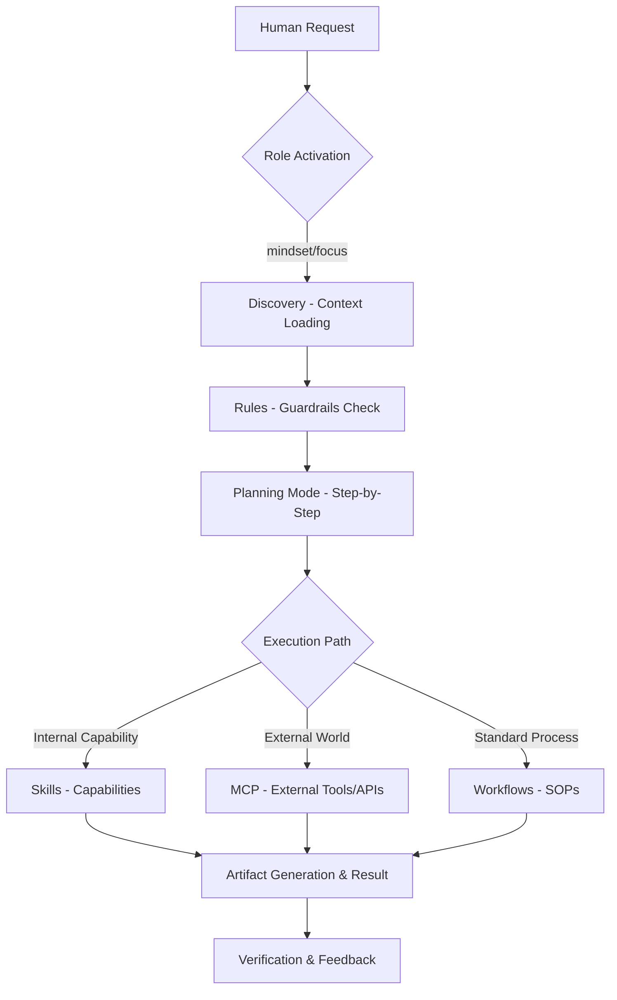

# MILKYWAY-CORE Handbook: Cẩm Nang Vận Hành Hệ Điều Hành Agile AI-Native

## Mục lục
1. [Giới thiệu hệ thống](#1-giới-thiệu-hệ-thống)
    - 1.1 [Quick-Start: Làm chủ hệ thống trong 5 phút](#11-quick-start-làm-chủ-hệ-thống-trong-5-phút)
2. [Làm chủ Antigravity IDE](#2-làm-chủ-antigravity-ide)
    - 2.1 [Giao tiếp hiệu quả (Communication Protocol)](#21-giao-tiếp-hiệu-quả-communication-protocol)
    - 2.2 [Chế độ Fast Mode vs Planning Mode](#22-chế độ-fast-mode-vs-planning-mode)
    - 2.3 [Hệ sinh thái Tooling (Bản đồ vũ khí)](#23-hệ-sinh-thái-tooling-bản-đồ-vũ-khí)
3. [ROLES & SKILLS](#3-roles--skills)
    - 3.1 [Nguyên tắc: "Role-Playing First"](#31-nguyên-tắc-role-playing-first)
    - 3.2 [Hệ thống Roles (Layered Persona)](#32-hệ-thống-roles-layered-persona)
    - 3.3 [Skill: Kỹ năng chuyên môn](#33-skill-kỹ-năng-chuyên-môn)
4. [Workflows (SOP tự động hóa)](#4-workflows-sop-tự-động-hóa)
    - 4.1 [Kích hoạt qua Slash Commands](#41-kích-hoạt-qua-slash-commands)
    - 4.2 [Các Workflows cốt lõi](#42-các-workflows-cốt-lõi)
5. [Rules (Kỷ luật thép)](#5-rules-kỷ-luật-thép)
    - 5.1 [Thực thi kỷ luật (Enforcement)](#51-thực-thi-kỷ-luật-enforcement)
    - 5.2 [Cơ chế Trigger Rules](#52-cơ-chế-trigger-rules)
6. [MCP (Model Context Protocol)](#6-mcp-model-context-protocol)
    - 6.1 [Khái niệm & Vai trò](#61-khái-niệm--vai-trò)
    - 6.2 [Kiến trúc Host-Client-Server](#62-kiến-trúc-host-client-server)
    - 6.3 [Cách cấu hình MCP Server](#63-cách-cấu-hình-mcp-server)
7. [Cấu trúc Tri thức và SSOT (Project Knowledge Architecture)](#7-cấu-trúc-tri-thức-và-ssot-project-knowledge-architecture)
    - 7.1 [Phân biệt docs/ vs knowledge-base/](#71-phân-biệt-docs-vs-knowledge-base)
    - 7.2 [Kỷ luật Dewey (Tổ chức tài liệu)](#72-kỷ-luật-dewey-tổ-chức-tài-liệu)
    - 7.3 [Quy trình ghi chép (Documentation as Code)](#73-quy-trình-ghi-chép-documentation-as-code)
8. [Ma trận so sánh & Luồng vận hành](#8-ma-trận-so-sánh-và-luồng-vận-hành)
9. [Quy trình làm việc chuẩn (Universal Workflow)](#9-quy-trình-làm-việc-chuẩn-universal-workflow)
10. [Best Practices (Advanced Guide)](#10-best-practices-khi-làm-việc-với-antigravity-advanced-guide)
11. [Hệ Tư Duy (Mindset) khi làm việc với AI](#11-hệ-tư-duy-mindset-khi-làm-việc-với-ai)
12. [What's next](#12-whats-next)
13. [Tài Liệu Tham Khảo](#13-tài-liệu-tham-khảo)

---

## 1. Giới thiệu hệ thống
**MILKYWAY-CORE** không đơn thuần là một bộ mã nguồn, mà là một **"Hệ điều hành cho Team"** (Operating System for Teams). Mục tiêu cốt lõi là chuyển đổi triết lý Agile và Scrum truyền thống sang mô hình **AI-Native** Agile/Scrum:

*   **Bộ não thứ 2 (The 2nd Brain):** Hệ lưu trữ tập trung tri thức, quy trình và thuật toán (SSOT). Giảm tải ghi nhớ cho Human, tập trung nguồn lực cho các quyết định chiến lược.
*   **AI-Native Agile:** Tích hợp AI vào mọi nhánh của Software Development Life Cycle (SDLC), từ Discovery Requirements đến Deployment & Ops.

### 1.1 Quick-Start: Làm chủ hệ thống trong 5 phút
Dành cho người mới bắt đầu, hãy thực hiện theo đúng thứ tự 3 bước sau để kích hoạt sức mạnh MILKYWAY-CORE:

1.  **Đánh thức AI (`/wake-up`):** Đây là lệnh đầu tiên bạn phải gõ. AI sẽ nạp "Bộ não dự án", các Quy tắc làm việc và sẵn sàng phục vụ.
2.  **Cung cấp tri thức (`@`):** Khi hỏi AI, hãy dùng phím `@` để trỏ đúng file tài liệu bạn muốn AI đọc. *Ví dụ: "Hãy tổng hợp @PRD-Feature-A.md".*
3.  **Lập kế hoạch trước khi làm:** Với các task phức tạp, hãy yêu cầu: *"Hãy đóng vai trò [PM/PO/BA/Architect] và lập kế hoạch thực hiện task X"*. Tuyệt đối không để AI tự ý sửa file mà chưa thông qua kế hoạch đã duyệt.

---

---

## 2. Làm chủ Antigravity IDE
**IDE** là giao diện chỉ huy trung tâm (Command Center), nơi bạn điều phối Đội ngũ AI của mình dựa trên kiến thức Local-First.

> **Quyết định chiến lược: Tại sao chọn IDE thay vì Web Chat?**
> *   **Nạp Context toàn diện:** Kích hoạt khả năng đọc hiểu Codebase, cấu trúc Dewey và Memory của dự án. Web Chat chỉ xử lý các mảnh dữ liệu rời rạc.
> *   **Implementation tức thời:** Cho phép AI tự động chạy Terminal, khởi tạo cấu trúc file và Verification kết quả ngay trên máy. 
> *   **Áp đặt Kỷ luật:** Buộc AI phải tuân thủ nghiêm ngặt Rules và Workflows của Team, triệt tiêu lỗi thủ công.

### 2.1 Giao tiếp hiệu quả (Communication Protocol)
*   **Ngôn ngữ:** Ưu tiên Tiếng Việt cho chỉ dẫn chính. Sử dụng thuật ngữ IT (English) để đảm bảo độ chính xác kỹ thuật.
*   **Tiêm Context (Context Injection):** Sử dụng phím `<kbd>@</kbd>` để nhắc đến file, folder hoặc symbols. Đây là cách nhanh nhất để AI nạp đúng Knowledge cần thiết.
    > 🛠️ **Tooling:** Kết hợp phím `@` với `grep_search` nếu bạn cần AI tìm kiếm nội dung sâu trong các file chưa mở.
*   **Tận dụng Phím tắt (Shortcuts):**
    *   `<kbd>Cmd + L</kbd>`: Mở trình Chat tổng quan.
    *   `<kbd>Cmd + I</kbd>`: Kích hoạt Inline Editor (AI sửa trực tiếp tại cursor).

### 2.2 Chế độ Fast Mode vs Planning Mode
*   **Fast Mode (Giải đáp nhanh):** 
    *   Sử dụng cho: Giải thích code, kiểm tra Syntax, câu hỏi ngắn.
    *   Hành động: Agent trả lời trực tiếp dựa trên Knowledge sẵn có.
*   **Planning Mode (Xây dựng chiến lược):**
    *   Sử dụng cho: Thay đổi cấu trúc file, Refactor, Implementation tính năng mới.
    *   Quy trình bắt buộc: **Discovery** -> **Create Plan** -> **User Approval** -> **Implementation**.
    *   Lợi ích: Đảm bảo mọi thay đổi đều có Artifacts đối soát và không gây lỗi Regression.

### 2.3 Hệ sinh thái Tooling (Bản đồ vũ khí)
Để thực thi các nhiệm vụ, Agent được trang bị bộ công cụ mạnh mẽ sau:

| Nhóm chức năng | Các công cụ tiêu biểu | Khả năng thực thi |
| :--- | :--- | :--- |
| **Quản trị Tệp tin** | `write_to_file`, `replace_file_content`, `list_dir`, `find_by_name`, `grep_search` | Tạo mới, sửa đổi mã nguồn, tìm kiếm nội dung và duyệt cấu trúc thư mục toàn diện. |
| **Implementation Hệ thống** | `run_command`, `command_status`, `read_terminal` | Chạy lệnh terminal, kiểm tra trạng thái build, chạy unit test và tương tác trực tiếp với OS. |
| **Truy vấn Knowledge** | `search_web`, `read_url_content`, `view_file_outline`, `view_code_item` | Tìm kiếm thông tin trên internet, đọc tài liệu online và phân tích sâu cấu trúc code/biểu đồ. |
| **Sáng tạo & UI** | `generate_image`, `browser_subagent` | Tạo hình ảnh/mockup chất lượng cao, điều khiển trình duyệt để test giao diện hoặc thu thập dữ liệu web. |
| **Kết nối MCP** | `mcp_clickup_...`, `mcp_sequential_thinking` | Tương tác trực tiếp với ClickUp (Task, Time tracking) và sử dụng các công cụ Management tuần tự phức tạp. |

---

## 3. ROLES & SKILLS
Thiết lập sức mạnh MILKYWAY-CORE dựa trên kiến trúc **Layered Persona** (Phân lớp định danh), tách biệt rõ giữa **Tư duy chiến lược (Role)** và **Công năng thực thi (Skill)**.

### 3.1 Nguyên tắc: "Role-Playing First"
Tuyệt đối không sử dụng Skill rời rạc. AI phải được đặt vào một lăng kính chuyên môn cụ thể để kích hoạt mindset đúng đắn.

> ⚠️ **Chỉ thị nghiêm ngặt:** Luôn ra lệnh mẫu: **"Hãy đóng vai trò X"** trước khi giao Task.
> Hệ thống sẽ tự động nạp **Role Definition** (`.agent/roles/*.md`) để thiết lập "Bộ lọc tư duy", giúp AI chọn Skill chuẩn xác 100%.

### 3.2 Hệ thống Roles (Layered Persona)
Kích hoạt các Roles chuyên gia theo nhu cầu dự án:
*   **PM:** Chiến lược & Roadmap.
*   **PO:** Quản trị Backlog & Vận hành Sprint.
*   **BA:** Giải quyết Problem-solving.
*   **Architect:** Thiết kế System-design.
*   **Senior AI Engineer:** Kiến tạo Agentic OS.
*   **Engineer:** Thực thi Builder mindset.
*   **QA:** Bảo vệ Gatekeeper mindset.

### 3.3 Skill: Kỹ năng chuyên môn
**Skills** cung cấp bộ hướng dẫn (Instructions) và scripts để Agent giải quyết các nhiệm vụ chuyên biệt.

*   **Cơ chế Role-Guided:** Agent chỉ dùng Skill khi được Role chỉ định trong phần `Skill Mapping`.
*   **Cấu trúc Skill:** 
    *   `SKILL.md`: Chứa logic thực thi.
    *   `scripts/`: Mã thực thi auto (Python/JS).
    *   `resources/`: Templates và Best-practices chuẩn.
*   **Phạm vi áp dụng:**
    *   **Workspace Scope**: Áp dụng cho Repo hiện tại.
    *   **Global Scope**: Áp dụng cho toàn máy tính.

---

## 4. Workflows (SOP tự động hóa)
**Workflows** vận hành các quy trình chuẩn (SOP) thông qua chuỗi các bước tự động.

### 4.1 Kích hoạt qua Slash Commands
*   **Sử dụng phím `<kbd>/</kbd>`**: Một danh sách các quy trình sẽ hiện ra.
*   **Chức năng:** Tự động hóa các chuỗi nhiệm vụ phức tạp mà không cần User phải Prompt từng bước.

### 4.2 Các Workflows cốt lõi
Hệ thống MILKYWAY-CORE ưu tiên các Workflows sau:
*   `/wake-up`: Khởi động hệ thống & nạp Context.

---

## 5. Rules (Kỷ luật thép)
**Rules** là các "hàng rào bảo vệ" (Guardrails) buộc AI phải tuân thủ trong mọi tình huống để duy trì chất lượng hệ thống.

### 5.1 Thực thi kỷ luật (Enforcement)
*   **Duy trì Kỷ luật:** Rules luôn nằm trong Context nền của Agent, ngăn chặn hiện tượng "quên" quy định dự án.
*   **Chống ảo giác (Anti-hallucination):** Rules buộc AI phải tra cứu SSOT trước khi khẳng định.

### 5.2 Cơ chế Trigger Rules
*   **Always-on:** Áp dụng xuyên suốt (Ví dụ: Quy định về ngôn ngữ Tiếng Việt).
*   **File-type glob:** Chỉ bật khi làm việc với file nhất định (Ví dụ: Clean Code cho `.ts`).
*   **Manual Trigger:** Kích hoạt chủ động qua chỉ thị của User.

---

## 6. MCP (Model Context Protocol)
**MCP** đại diện cho **"Cánh tay nối dài"** - đây là kết nối tới thế giới bên ngoài.

- Ví dụ: Figma, ClickUp, Notion, Google Drive, NotebookLM, Context7,...

### 6.1 Khái niệm & Vai trò
*   **USB-C cho AI:** Model Context Protocol là một tiêu chuẩn mở giúp AI agent kết nối an toàn với các công cụ, cơ sở dữ liệu và API bên ngoài mà không cần viết code tích hợp tùy chỉnh cho từng dịch vụ.
*   **Vượt qua dữ liệu tĩnh:** Thay vì chỉ làm việc với các file cục bộ, MCP cho phép Agent truy cập vào các dữ liệu bên ngoài hệ thống.

### 6.2 Kiến trúc Host-Client-Server
*   **MCP Host:** IDE Antigravity.
*   **MCP Client:** Thành phần bên trong IDE quản lý các phiên kết nối và quyền hạn.
*   **MCP Server:** Các ứng dụng/dịch vụ bên ngoài (Ví dụ: Server ClickUp, Server Postgres) cung cấp 3 tài nguyên chính:
    *   **Tools:** Các hàm Implementation (Tạo task, query data).
    *   **Resources:** Các Knowledge Source (File, Environment Variables).
    *   **Prompts:** Các hướng dẫn Context mẫu.

### 6.3 Cách cấu hình MCP Server
Người dùng có thể thêm các MCP Server thông qua file cấu hình `~/.gemini/antigravity/mcp_config.json` hoặc giao diện Settings.

## 7. Cấu trúc Tri thức và SSOT (Project Knowledge Architecture)
MILKYWAY-CORE vận hành trên nguyên tắc **Single Source of Truth (SSOT)**. Mọi tri thức cũ và mới đều phải được lưu trữ đúng vị trí để AI có thể "Discovery" chính xác.

### 7.1 Phân biệt `docs/` vs `knowledge-base/`
*   **`docs/` (Project Docs):** Chứa tri thức **đặc thù** của dự án hiện tại (Requirements, Specs, Sprint Plan, Design Assets) chuẩn AGILE. Đây là nơi AI tìm kiếm câu trả lời cho câu hỏi: *"Dự án này đang làm gì?"*.
*   **`knowledge-base/` (Base Knowledge):** Chứa **tri thức nền tảng** (Standards, Best Practices) và **Hệ thống Ký ức** (Project/Role Memory). Đây là nơi AI tìm kiếm câu trả lời cho câu hỏi: *"Làm dự án này như thế nào cho đúng chuẩn và kế thừa kinh nghiệm cũ?"*.

### 7.2 Kỷ luật Dewey (Tổ chức tài liệu)
Tất cả thư mục và file phải tuân thủ hệ thống phân loại Dewey để đảm bảo tính sắp xếp logic và dễ tìm kiếm:
1.  **010-099 / 01-09 (Metas):** Thuật ngữ, Glossary, Danh mục.
2.  **100-199 / 10-19 (Instructions/Technical):** Quy định kỹ thuật, SDD, Coding Standards.
3.  **200-299 / 20-29 (Governance):** Quy trình quản lý, PMP, SOP.
4.  **300-399 / 30-39 (Specs/Domain):** Đặc tả dự án (`docs/`) hoặc Kiến thức nghiệp vụ (`knowledge-base/`).
5.  **400-499 / 40-49 (Memory):** Ký ức dự án và Ký ức vai trò (Role Memory).

> 💡 **Quy tắc độ dài mã:** Dự án cụ thể tại `docs/` dùng 3 chữ số (VD: `030`). Tri thức nền tảng tại `knowledge-base/` dùng 2 chữ số (VD: `30`).

### 7.3 Hệ thống Ký ức (Memory System)
Ký ức là thành phần "sống" của hệ thống, giúp AI học hỏi từ quá khứ và không lặp lại sai lầm:
*   **Project Memory (40-Memory):** Ký ức tập thể. Chứa lịch sử nỗ lực, After Action Reviews (AAR), và các quyết định chiến lược có ảnh hưởng đến toàn dự án.
*   **Role Memory (45-Role-Memory):** Ký ức chuyên gia. Chứa các "mẹo", mẫu hình (patterns) và giải pháp kỹ thuật cụ thể đã đúc kết được của từng Role.
*   **Cơ chế nạp:** AI bắt buộc phải "Discovery" ký ức theo thứ tự: **Bối cảnh chung (Project Memory)** -> **Kinh nghiệm riêng (Role Memory)**.

### 7.4 Quy trình ghi chép (Documentation as Code)
*   **Frontmatter:** Bắt buộc có Metadata ở đầu file (id, type, status, linked-to) để AI ánh xạ quan hệ.
*   **Wiki-linking:** Sử dụng cú pháp `[[File-Name]]` để liên kết các thực thể tri thức, tạo thành mạng lưới tri thức (Knowledge Graph).

---

## 8. Ma trận so sánh và Luồng vận hành

### 8.1 Ma trận công cụ
| Tiêu chí | SKILLS | Workflows | Rules | MCP |
| :--- | :--- | :--- | :--- | :--- |
| **Bản chất** | Chuyên môn | Quy trình | Kỷ luật | Kết nối ngoại vi |
| **Kích hoạt** | AI tự nạp | Con người gọi `/` | Hệ thống áp đặt | AI gọi Tools |
| **Mục đích** | Mở rộng năng lực | Tự động hóa | Kiểm soát hành vi | Kết nối thế giới thực |
| **Dữ liệu** | Nội bộ (.agent) | Nội bộ (.agent) | Nội bộ (.agent) | Bên ngoài (API/DB) |

### 8.2 Luồng thực thi Logic (Mental Model)
Để hiểu rõ cách các thành phần này "nhảy múa" cùng nhau, hãy nhìn vào luồng tư duy dưới đây:

---

## 9. Quy trình làm việc chuẩn (Universal Workflow)
Tùy vào độ phức tạp, AI sẽ linh hoạt áp dụng, nhưng **LUÔN** đảm bảo cốt lõi tư duy sau:

1.  **Discovery (Context & Discovery):**
    *   **Thứ tự ưu tiên:** Rules (Guardrails) -> **Project Memory (Bối cảnh chung)** -> **Role Memory (Kinh nghiệm vai trò)** -> SSOT (`docs/`).
    *   **QUAN TRỌNG:** Phải nạp đủ Context để hiểu "đã làm gì" và "làm như thế nào cho đúng" trước khi bắt đầu.

2.  **Solution Design:**
    *   Phác thảo Logic, Architecture, cấu trúc nội dung hoặc thuật toán.
    *   Đặt câu hỏi phản biện: "Giải pháp này có đơn giản nhất chưa? Có vi phạm Rule nào không?".

3.  **Planning:**
    *   Chia nhỏ công việc thành các bước nhỏ.
    *   Trình bày **Step-by-Step Plan** và đợi **User/System Approve**. (Bắt buộc với task thay đổi file hệ thống).

4.  **Implementation:**
    *   Triển khai code/Task theo kế hoạch đã duyệt.
    *   Tuân thủ nguyên tắc: "Code đến đâu, test/review đến đó".

5.  **Verification:**
    *   Tự chạy kiểm thử (Run Tests), Review lại Code/Task so với Requirement ban đầu.
    *   Đảm bảo không phá vỡ các chức năng hiện có (Regression Check).

6.  **Finalize & Learning Loop:**
    *   Cập nhật lại tài liệu (`docs/`) nếu có thay đổi.
    *   Ghi nhớ bài học mới hoặc cập nhật Rule vào Memory `knowledge-base/` nếu phát hiện vấn đề mới (Learning Loop).

---

## 10. Best Practices khi làm việc với Antigravity (Advanced Guide)

### 10.1 Bí quyết xây dựng SKILL chuẩn
Để xây dựng một Skill mạnh mẽ, không bị "loãng" và Agent luôn tìm thấy đúng lúc, hãy áp dụng các nguyên tắc sau:

*   **Nguyên tắc Atomic & Focused (Nguyên tử hóa):**
    *   Mỗi Skill chỉ nên giải quyết **MỘT** vai trò hoặc **MỘT** nhóm nhiệm vụ cụ thể (Ví dụ: `clickup-expert` chỉ lo về ClickUp, không kiêm nhiệm refactor code).
    *   Tránh tạo "Super-Skill" ôm đồm quá nhiều instruction dẫn đến Agent bị loạn context.
*   **Tối ưu hóa Semantic Discovery (Khám phá ngữ nghĩa):**
    *   Phần `description` trong YAML frontmatter là quan trọng nhất. Đây là dữ liệu dùng cho Smart Search/Vector Search để AI tìm thấy Skill.
    *   *Mẹo:* Hãy viết mô tả ở ngôi thứ ba, mô tả rõ **Skill này làm gì?** và **Dùng khi nào?** (Ví dụ: "Skill này giúp phân tích Sprint Metrics và tạo báo cáo cho Scrum Master").
*   **Cơ chế Progressive Disclosure (Tiết lộ dần dần):**
    *   Không nhồi nhét hàng ngàn dòng code vào file `SKILL.md`. 
    *   Hãy chia nhỏ: Instruction nằm trong `SKILL.md`, logic thực thi nằm trong `scripts/`, tài liệu tra cứu nằm trong `resources/`. Agent sẽ chỉ đọc các file phụ khi thực sự cần.
*   **Sử dụng Few-Shot Prompting (Học qua ví dụ):**
    *   Cung cấp 2-3 ví dụ mẫu trong thư mục `examples/` theo cấu trúc: `Yêu cầu -> Tư duy (Thought) -> Hành động (Action) -> Kết quả (Output)`.
    *   Điều này giúp Agent nắm bắt được "Style" làm việc mà bạn mong muốn nhanh hơn bất kỳ câu lệnh nào.
*   **Kiểm soát Token Hygiene:**
    *   Giữ Metadata (YAML) dưới 100 tokens. 
    *   Xóa bỏ các instructions thừa hoặc lỗi thời để tiết kiệm context window và tăng tốc độ xử lý.
*   **Tạo SKILL mới:**
    *   Sử dụng skill skill-creator để viết SKILL
    *   Tham khảo websites: https://skillsmp.com/ https://skills.sh/ https://context7.com/skills https://github.com/sickn33/antigravity-awesome-skills
    *   Chú ý về vấn đề bảo mật, Prompt Injection, đọc kỹ Skill trước khi triển khai, sử dụng Tiếng Việt.
    *   Phải custom lại cho phù hợp với hệ thống của mình.

### 10.2 Bí quyết xây dựng RULES chuẩn
RULES là "Kỷ luật thép" để duy trì chất lượng hệ thống. Để viết Rules hiệu quả và chống ảo giác (Anti-hallucination), hãy tuân thủ các bí quyết sau:

*   **Nguyên tắc "Specific & Actionable" (Cụ thể & Thực thi):**
    *   Tránh các câu lệnh mơ hồ như "Hãy viết code tốt". 
    *   Hãy thay bằng: "Sử dụng camelCase cho biến", "Mỗi hàm không quá 20 dòng", hoặc "Luôn viết Unit Test bằng Jest cho các hàm logic".
*   **Xây dựng rào chắn (Guardrails):**
    *   Định nghĩa rõ những gì AI **KHÔNG** được làm (Ví dụ: "Không bao giờ hardcode API Key", "Không sử dụng thư viện X vì lý do bảo mật").
    *   Sử dụng Rules như một bộ lọc an toàn trước khi AI thực thi các lệnh nguy hiểm.
*   **Tổ chức phân cấp (Hierarchy Strategy):**
    *   **Global Rules:** Đặt tại `~/.gemini/` cho các quy tắc bất biến (Ngôn ngữ, Phong cách giao tiếp).
    *   **Workspace Rules:** Đặt tại `.agent/rules/` cho các quy tắc riêng của dự án (Tech stack, Folder structure).
*   **Trigger thông minh bằng Glob Patterns:**
    *   Đừng để mọi Rule đều là "Always-on" (luôn bật) vì sẽ làm lãng phí Token.
    *   Sử dụng `globs` trong YAML để Rule chỉ kích hoạt khi Agent mở đúng loại file liên quan (Ví dụ: Rule về CSS chỉ bật khi Agent sửa file `.css` hoặc `.scss`).
*   **Kỷ luật chống ảo giác (Anti-hallucination Disciplines):**
    *   Yêu cầu Agent: "Nếu không chắc chắn về đường dẫn file, hãy dùng `ls` để kiểm tra trước khi trả lời".
    *   Buộc Agent phải trích dẫn nguồn hoặc SSOT (`docs/`) khi đưa ra các nhận định về quy trình nghiệp vụ.
*   **Quy trình "Review Policy":**
    *   Thiết lập Rule yêu cầu Agent luôn phải hỏi ý kiến User (`request review`) trước khi thực hiện các hành động có tính rủi ro cao hoặc không thể đảo ngược (Xóa file, Pushing code).

### 10.3 Bí quyết xây dựng WORKFLOW chuẩn
WORKFLOW là "xương sống" của các quy trình tự động hóa lặp đi lặp lại. Để xây dựng Workflow mạnh mẽ và mượt mà, hãy áp dụng các bí quyết sau:

*   **Tính Modularity (Mô-đun hóa):**
    *   Chia nhỏ các quy trình lớn thành các "Sub-workflows" hoặc các bước con lồng nhau. 
    *   *Mẹo:* Một Workflow có thể gọi một Workflow khác. Điều này giúp bạn dễ dàng bảo trì và tái sử dụng các đoạn quy trình phổ biến (như quy trình commit code hoặc báo cáo).
*   **Sử dụng Step Annotations (Chú thích bước):**
    *   **`// turbo`**: Đặt phía trên một bước thực thi lệnh (run_command) để cho phép Agent tự động chạy lệnh đó mà không cần hỏi bạn. Hãy dùng cho các lệnh an toàn (như `ls`, `mkdir`).
    *   **`// turbo-all`**: Đặt ở đầu file Workflow để cho phép Agent tự động chạy **MỌI** bước trong workflow. Chỉ dùng khi bạn đã cực kỳ tin tưởng vào độ ổn định của quy trình.
*   **Thiết kế luồng Input & Output minh bạch:**
    *   Định nghĩa rõ các đối số (arguments) mà Workflow cần nhận (Ví dụ: tên task, mã ID).
    *   Yêu cầu Agent tóm tắt kết quả (Output) sau mỗi bước quan trọng để bạn dễ dàng theo dõi tiến độ.
*   **Xử lý trạng thái lỗi (Error Handling):**
    *   Đừng để Agent "bỏ cuộc" ngay khi gặp lỗi nhỏ. Hãy hướng dẫn Agent cách tóm tắt lỗi, đề xuất giải pháp sửa lỗi hoặc dừng lại ở trạng thái an toàn để chờ Human can thiệp.
    *   *Mẹo:* Thêm bước "Verify" (Kiểm tra) sau mỗi hành động thực thi quan trọng để đảm bảo bước tiếp theo có dữ liệu đầu vào đúng đắn.
*   **Tận dụng Agent-generated Workflows:**
    *   Nếu bạn thấy mình đang lặp lại một chuỗi hành động thủ công, hãy bảo Agent: "Hãy quan sát quy trình tôi vừa làm và viết thành một file Workflow `.md` để lần sau tôi có thể gọi bằng lệnh `/`".

### 10.4 Bí quyết cộng tác Human Vs Agent
Để trở thành một "Thuyền trưởng" thực thụ điều phối đội ngũ AI, hãy áp dụng các chiến lược tương tác sau:

*   **Quản trị hệ sinh thái SKILLS (Skills Ecosystem Management):** 
    *   Nên tổ chức tốt hệ thống SKILLS, phân định rõ ràng trách nhiệm để tránh bị conflict (chồng chéo) chức năng giữa các chuyên gia AI.
    *   Kiểm soát số lượng: Không nên vượt quá **50 skills** trong một dự án. Việc sở hữu quá nhiều skill sẽ làm tăng "độ nhiễu" (noise) khi AI thực hiện Discovery, dễ dẫn đến việc chọn sai vai trò hoặc lãng phí context window.
*   **Xác nhận Skill trước khi thực thi:** 
    *   Nếu bạn đang thực hiện một task quan trọng và không chắc Agent sẽ tự nạp Skill nào cho tối ưu, hãy hỏi trước: "Với task này, bạn định sử dụng SKILL nào? Nội dung skill đó có phù hợp với yêu cầu X của tôi không?". 
    *   Việc này giúp tránh tình trạng Agent sử dụng sai "mindset chuyên gia".
*   **"Hỏi trước, Làm sau" với các Task khó:** 
    *   Khi đối mặt với một codebase mới hoặc logic phức tạp, đừng ra lệnh thực hiện ngay. Hãy yêu cầu Agent thực hiện **Exploration (Khám phá)**: "Hãy khám phá luồng User Auth trong codebase này và giải thích cho tôi", "Trong folder X có những thành phần nào liên quan đến logic Y?", "Nếu là bạn, bạn sẽ refactor phần này như thế nào?".
    *   Sử dụng Agent như một công cụ truy vấn tri thức (Knowledge Query) trước khi biến nó thành công cụ thực thi (Execution Tool).
*   **Khai thác tri thức Role-playing:** 
    *   Đừng chỉ ra lệnh chung chung. Hãy ép Agent vào một lăng kính chuyên môn cụ thể: "Hãy đóng vai Senior Technical Lead để review file này về mặt bảo mật", hoặc "Hãy đóng vai Business Analyst để bắt bẻ các edge cases trong User Story này".
    *   Mỗi "vai diễn" sẽ kích hoạt các tập luật (Rules) và kinh nghiệm ẩn khác nhau trong mô hình.
*   **Context Grooming & Hygiene (Vệ sinh ngữ cảnh):** 
    *   Đừng "ném" 100 file vào Agent cùng một lúc. Hãy nạp lần lượt các tài liệu quan trọng nhất. Nếu thấy Agent bắt đầu trả lời sai lệch, hãy dùng lệnh reset context hoặc nhắc lại các SSOT quan trọng.
*   **Verify via Artifacts (Kiểm chứng qua bằng chứng):** 
    *   Luôn yêu cầu Agent xuất bản các "Artifacts" trung gian: "Hãy tạo một Implementation Plan trước khi sửa code", "Cho tôi xem Walkthrough sau khi bạn hoàn thành". 
    *   Artifacts chính là "hợp đồng" cam kết giữa Người và AI.
*   **Thanh trừng Hallucination:** 
    *   Nếu AI trả lời mơ hồ, hãy yêu cầu: "Dùng tool `ls`, `grep_search` hoặc `view_file` để check lại thực tế đường dẫn này thay vì phỏng đoán".
   
---
 
### 9.5 Case Studies (Ví dụ thực tiễn)
Dưới đây là tóm tắt cách vận hành **Universal Workflow** cho các tình huống thực tế, đảm bảo tính liên kết (Traceability) và kỷ luật SSOT.

| Vai trò | Nhiệm vụ | Luồng thực thi (Flow) | Sản phẩm đầu ra (Artifacts) |
| :--- | :--- | :--- | :--- |
| **QA Lead** | Viết Test Case cho Reset Password | `/wake-up` -> Đọc Story & Template -> Lập Plan tạo file -> Thực thi `write_to_file` -> Cập nhật MOC. | File `TC-Auth-005.md` với Frontmatter & Gherkin |
| **Designer** | Xây dựng Design System (Colors) | `/wake-up` -> Kiểm tra folder Design -> Thiết kế JSON Tokens -> Tạo Docs màu sắc -> Cập nhật Design MOC. | Các file `colors.json`, `Colors.md` |
| **BA** | Chuyển Requirement thành User Stories | `/wake-up` -> Đọc BRD -> Tách tính năng thành các Story nguyên tử -> Tạo file Story kèm link BRD -> Cập nhật Backlog MOC. | Các file `Story-ViewRevenue.md`, `Story-FilterReport.md` |

**Nguyên tắc chung áp dụng trong các ví dụ:**
1.  **Discovery:** AI luôn dùng `ls` hoặc `view_file` để check thực tế trước khi khẳng định.
2.  **Planning:** Mọi thay đổi file đều phải có bước "Approve" từ Human.
3.  **Traceability:** Frontmatter luôn chứa `linked-to` để kết nối các tài liệu với nhau.

---

## 11. Hệ Tư Duy (Mindset) khi làm việc với AI
Làm việc với Agentic AI không chỉ là kỹ năng viết prompt, mà là sự thay đổi về mặt tư duy (Mindset Shift). 

> ⚠️ **Mindset Check:** Đừng mong đợi AI hoàn hảo ngay lập tức. Hãy coi quá trình làm việc là một buổi "Pair Programming" nơi bạn là người dẫn đường.

Dưới đây là 5 hệ tư duy cốt lõi:

### 11.1 Tư duy "Thuyền trưởng & Thủy thủ" (Pilot vs Junior)
*   **AI là Junior cực nhanh:** Hãy coi AI là một cộng sự Junior nhiệt huyết, tốc độ xử lý "khủng" nhưng vẫn có thể mắc những lỗi logic tinh vi.
*   **Bạn là Thuyền trưởng (Pilot):** Bạn chịu trách nhiệm về "hải trình" (Mission), an toàn của hệ thống và kết quả cuối cùng. Đừng bao giờ phó mặc hoàn toàn cho AI; hãy là người đưa ra các quyết định (Checkpoints) quan trọng.

### 11.2 Tư duy "Đặc tả trước, Thực thi sau" (Spec-Driven Thinking)
*   **Rõ ràng là sức mạnh:** AI không thể đọc được suy nghĩ của bạn. Nếu "Input" mờ nhạt, "Output" sẽ rác rưởi (Garbage In, Garbage Out).
*   **Ưu tiên Specs:** Luôn đòi hỏi hoặc tự tay viết các bản đặc tả (User Story, API Spec, UI Mockup,...) trước khi yêu cầu AI viết code. Đặc tả chính là "ngôn ngữ chung" để bạn và AI hiểu nhau.

### 11.3 Tư duy Phản biện & Tra soát nguồn (Critical Thinking & Traceability)
*   **Tin tưởng nhưng phải kiểm chứng (Trust but Verify):** Đừng bị đánh lừa bởi phong thái tự tin của AI. Hãy luôn đặt câu hỏi về tính đúng đắn của logic mà nó vừa triển khai.
*   **Truy vấn phương pháp luận:** Hãy chủ động hỏi AI về cách nó vừa giải quyết vấn đề:
    *   "Bạn đã thực hiện task này bằng cách nào? Logic cốt lõi nằm ở đâu?"
    *   "Tại sao bạn lại chọn giải pháp A thay vì giải pháp B?"
*   **Tra soát nguồn gốc tri thức:** Đây là bước quan trọng để phân biệt giữa "ảo giác" và "thực tế". Hãy yêu cầu AI làm rõ:
    *   "Kiến thức bạn vừa dùng đến từ đâu? Từ kiến thức nền (General Knowledge) của bạn hay từ các file cụ thể trong dự án này?"
    *   "Bạn có đang tuân thủ đúng Rules/SOP nào của dự án không? Hãy trích dẫn file đó."
*   **Yêu cầu bằng chứng thực tế:** Khi AI khẳng định điều gì đó, hãy buộc nó sử dụng tool để chứng minh: "Dùng tool `view_file` hoặc `run_command` để verify lại file/kết quả này cho tôi". Một "Thuyền trưởng" giỏi luôn nhìn vào bằng chứng thay vì nghe lời hứa.

### 11.4 Tư duy "Hệ thống" (Systems Thinking) - Nhìn cả rừng, đừng chỉ nhìn cây
Đối với người mới, tư duy hệ thống có thể hiểu đơn giản là cách nhìn nhận sự kết nối giữa các thành phần:

*   **Tư duy "Zoom-out" (Nhìn toàn cảnh):** Đừng chỉ tập trung vào một dòng code đơn lẻ. Hãy tưởng tượng dự án là một bộ xếp hình; nếu bạn thay đổi Rule này ở Backend, hãy tự hỏi liệu nó có làm hỏng giao diện ở Frontend không? AI không làm việc cô lập, nó là một phần trong "hệ sinh thái" dự án của bạn.
*   **Hiệu ứng dây chuyền (Ripple Effects):** Một viên đá nhỏ ném xuống hồ sẽ tạo ra nhiều vòng sóng. Tương tự, một yêu cầu mơ hồ về bảo mật ở đầu dự án có thể dẫn đến hàng loạt lỗi nghiêm trọng khi triển khai thực tế. Hãy luôn dự đoán các "con sóng" mà yêu cầu của bạn tạo ra.
*   **Quản trị Context như "Nguồn thức ăn":** Hãy coi Context (ngữ cảnh) của AI là một hồ chứa dữ liệu có hạn. Nếu bạn nạp quá nhiều thông tin rác, AI sẽ bị "bội thực" và trả lời sai. Tư duy hệ thống giúp bạn biết chọn lọc đúng "thức ăn" (file nào cần, file nào không) để AI luôn minh mẫn nhất.
*   **Tìm kiếm "Điểm đòn bẩy":** Thay vì sửa 100 lỗi thủ công, đôi khi chỉ cần điều chỉnh 1 dòng trong file `RULES` là toàn bộ hệ thống sẽ tự động tốt lên. Đó chính là sức mạnh của việc hiểu rõ "mạch máu" của hệ thống.

---

## 12. What's next
Hành trình làm chủ MILKYWAY-CORE của bạn chỉ mới bắt đầu. Để tiến xa hơn và thực sự trở thành một "Architect" trong kỷ nguyên AI-Native, hãy tập trung vào các định hướng sau:

*   **Deep-dive vào hạ tầng SKILLS & Workflows:**
    *   Không chỉ dừng lại ở việc sử dụng, hãy bắt đầu tự tay xây dựng các Skills chuyên biệt cho nghiệp vụ của riêng bạn.
    *   Học cách đóng gói logic phức tạp vào `scripts/` và tối ưu hóa Instruction để đạt độ chính xác 100%.
*   **Thực chiến và Tối ưu hóa hàng ngày:**
    *   Áp dụng MILKYWAY-CORE vào mọi ngóc ngách của công việc: từ việc soạn thảo email, research tài liệu, lập kế hoạch, build tool/MVP, Coding, Testing, Deployment, Design.
    *   Sau mỗi Task, hãy hỏi MILKYWAY-CORE: "Làm thế nào để quy trình này nhanh hơn/tốt hơn vào lần sau?" và cập nhật bài học vào Knowledge Base.
*   **Xây dựng Personal OS (Hệ điều hành cá nhân):**
    *   Sử dụng cấu trúc của MILKYWAY-CORE để xây dựng "Bộ não thứ 2" cho việc học tập và phát triển bản thân.
    *   Số hóa tri thức, kinh nghiệm cá nhân và đóng gói chúng thành các SKILLS/ Knowledge base cho AI để chúng có thể hỗ trợ bạn mọi lúc, mọi nơi.

---

## 13. Tài Liệu Tham Khảo
1. [Antigravity Docs: Skills Overview](https://antigravity.google)
2. [Antigravity Docs: Rules & Workflows Guide](https://antigravity.google)
